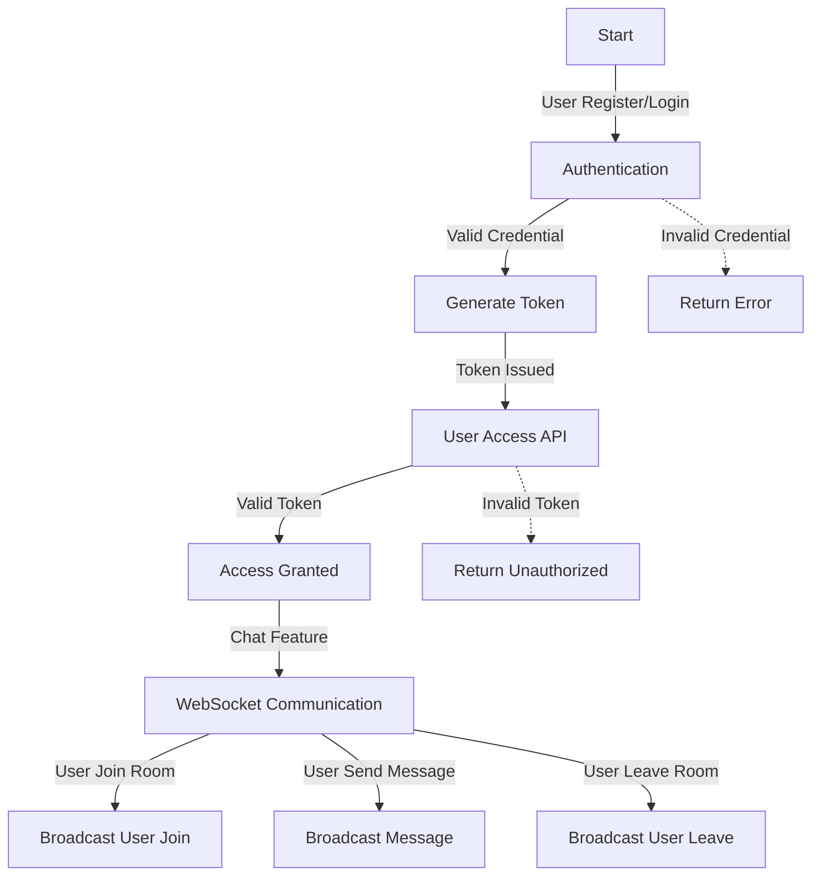
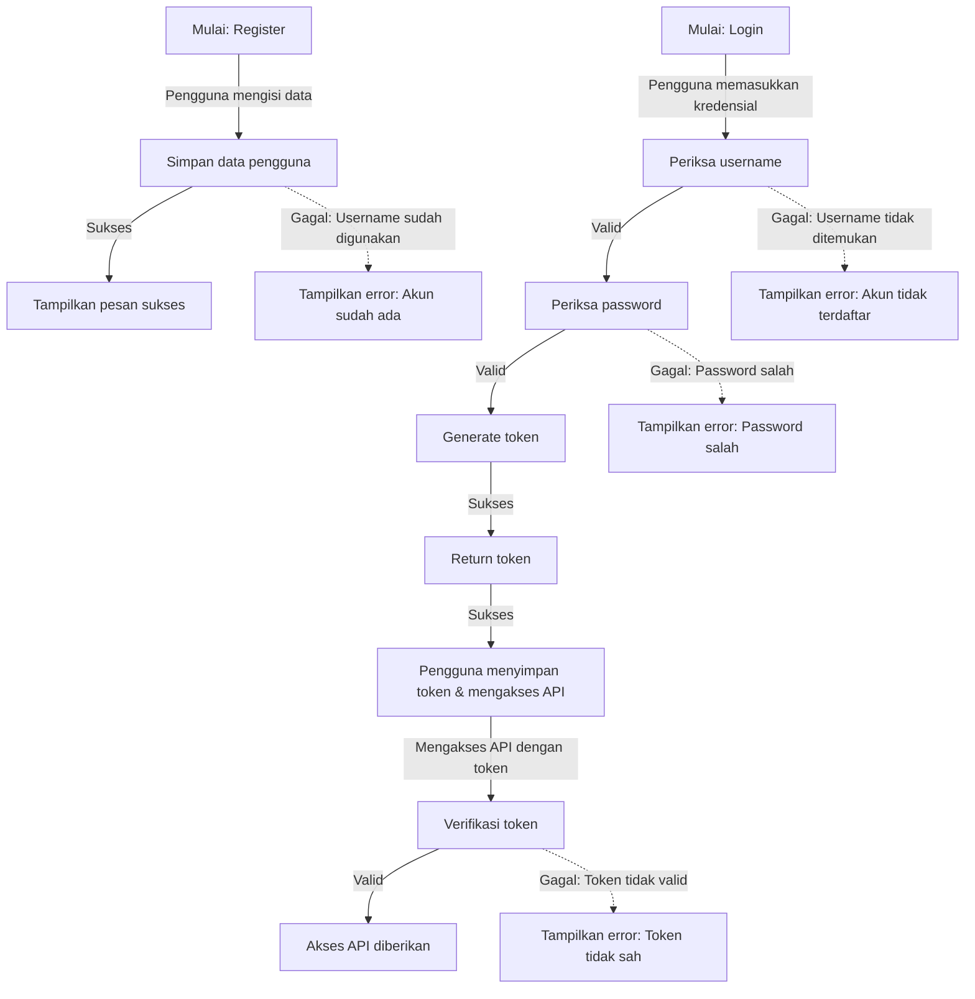

# NestJS - Framework Backend Modern dan Efisien

<p align="center">
  <a href="http://nestjs.com/" target="blank"></a>
</p>

<p align="center">
  <a href="https://www.npmjs.com/~nestjscore" target="_blank"></a>
  <a href="https://www.npmjs.com/~nestjscore" target="_blank"></a>
  <a href="https://www.npmjs.com/~nestjscore" target="_blank"></a>
  <a href="https://circleci.com/gh/nestjs/nest" target="_blank"></a>
  <a href="https://coveralls.io/github/nestjs/nest?branch=master" target="_blank"></a>
  <a href="https://discord.gg/G7Qnnhy" target="_blank"></a>
  <a href="https://opencollective.com/nest#backer" target="_blank"></a>
  <a href="https://opencollective.com/nest#sponsor" target="_blank"></a>
  <a href="https://paypal.me/kamilmysliwiec" target="_blank"></a>
</p>

---

## 📌 Pendahuluan

NestJS adalah framework berbasis TypeScript untuk pengembangan backend yang modular, efisien, dan fleksibel. Dengan konsep arsitektur berbasis modul, NestJS memungkinkan pengelolaan fitur aplikasi yang lebih terstruktur dan terorganisir. Beberapa keunggulan utama dari NestJS meliputi:

- **Dependency Injection (DI)** untuk kode yang lebih bersih dan mudah diuji.
- **Middleware, Interceptor, Pipe, dan Guard** untuk keamanan dan fleksibilitas pengolahan data.
- **Dukungan integrasi** dengan berbagai teknologi seperti database, API eksternal, dan layanan real-time.
- **Fitur bawaan** seperti validasi data, logging, dan dokumentasi API otomatis.

## ⚙️ Prinsip NestJS

Pengembangan aplikasi dengan NestJS berfokus pada beberapa prinsip utama:

- **Modularitas Sistem** – Pengelolaan berbasis modul untuk meningkatkan skalabilitas.
- **Dependency Injection** – Manajemen dependensi yang lebih fleksibel.
- **Middleware & Guards** – Sistem keamanan dan kontrol akses yang kuat.
- **Validasi & Exception Handling** – Penanganan data dan kesalahan yang sistematis.
- **Real-time Communication** – Mendukung WebSockets untuk komunikasi real-time.
- **Manajemen Konfigurasi** – Pengaturan parameter yang lebih terpusat.
- **Logging & Monitoring** – Pemantauan dan debugging yang lebih efektif.

## 🗄️ Pengolahan Database

Sistem backend memproses data melalui tahapan berikut:

1. **Penerimaan Permintaan** – Backend menerima permintaan melalui HTTP/WebSocket.
2. **Validasi Data** – Memeriksa kesesuaian data dengan aturan yang telah ditentukan.
3. **Interaksi Database** – Mengambil atau menyimpan data ke dalam database.
4. **Penyusunan Respons** – Mengemas hasil pemrosesan data dan mengirimkan ke klien.

## 🔄 Model Komunikasi dalam Backend

NestJS mendukung berbagai model komunikasi dengan klien, termasuk:

- **RESTful API** – Model berbasis HTTP menggunakan metode GET, POST, PUT, DELETE.
- **GraphQL** – Memungkinkan pengambilan data yang lebih fleksibel.
- **WebSockets** – Komunikasi dua arah untuk transfer data real-time.
- **gRPC** – Serialisasi berbasis Protobuf untuk performa yang lebih optimal.

## 🔐 Keamanan dalam Backend

Keamanan menjadi aspek penting dalam pengembangan backend. Strategi yang umum digunakan meliputi:

- **Autentikasi & Otorisasi** – OAuth, JWT, atau sesi berbasis token.
- **Enkripsi Data** – Menggunakan AES atau RSA untuk perlindungan informasi.
- **Firewall API** – Membatasi akses tidak sah dan serangan brute-force.
- **Rate Limiting** – Membatasi jumlah permintaan untuk menghindari penyalahgunaan.
- **Keamanan Basis Data** – Menerapkan akses minimal dan enkripsi data.

# 📌 Project Structure & Workflow

## 1. Struktur Folder
```bash
BELAJAR-NEST/
│-- dist/                  # Hasil build proyek
│-- node_modules/          # Dependensi proyek
│-- prisma/                # Konfigurasi Prisma ORM
│-- src/                   # Source code utama
│   ├── chat/              # Modul chat
│   │   ├── chat.gateway.ts       # WebSocket untuk chat
│   │   ├── chat.module.ts        # Modul chat
│   │   ├── chat.service.ts       # Service chat
│   │   ├── client.html           # Tampilan client chat
│   │   ├── styles.css            # Styling chat
│   ├── dto/               # Data Transfer Object (DTO)
│   │   ├── create-mahasiswa.dto.ts
│   │   ├── create-ruangan.dto.ts
│   │   ├── login-user.dto.ts
│   │   ├── register-user.dto.ts
│   │   ├── search-mahasiswa.dto.ts
│   │   ├── update-mahasiswa.dto.ts
│   ├── entity/            # Entitas database
│   │   ├── user.entity.ts
│   ├── profile/           # Modul profile
│   │   ├── profile.controller.ts  # Controller Profile
│   │   ├── profile.module.ts      # Module Profile
│   │   ├── profile.service.ts     # Service Profile
│   ├── shared/            # Shared modules & services
│   │   ├── app.controller.ts
│   │   ├── app.module.ts
│   │   ├── auth.guard.ts          # Middleware autentikasi
│   │   ├── auth.module.ts         # Modul autentikasi
│   │   ├── prisma.service.ts      # Service Prisma
│-- test/                  # Unit & integration tests
│-- uploads/               # Folder penyimpanan file upload
│-- .env                   # Konfigurasi environment
│-- .gitignore             # File yang diabaikan Git
│-- package.json           # Konfigurasi npm
│-- README.md              # Dokumentasi proyek
│-- tsconfig.json          # Konfigurasi TypeScript
```

## 2. Alur Kerja


## 3. Cara Menjalankan Proyek
```bash
# Install dependencies
yarn install  # atau npm install

# Menjalankan server dalam mode development
yarn start:dev  # atau npm run start:dev

# Menjalankan server dalam mode production
yarn build && yarn start  # atau npm run build && npm start

# Menjalankan Prisma migration
yarn prisma migrate dev  # atau npx prisma migrate dev
```

## 4. Teknologi yang Digunakan
- **NestJS** - Framework backend berbasis TypeScript
- **Prisma ORM** - Manajemen database
- **WebSocket** - Komunikasi real-time
- **JWT (JSON Web Token)** - Autentikasi
- **TypeScript** - Bahasa utama
- **PostgreSQL/MySQL** - Database

📌 **Catatan:** 
- Pastikan `.env` sudah dikonfigurasi dengan benar sebelum menjalankan proyek.
- Dokumentasi API dapat ditemukan di endpoint `/api/docs` jika menggunakan Swagger.

🚀 **Selamat coding!**


## 🚀 Menjalankan Proyek

Untuk menjalankan proyek dalam mode pengembangan, gunakan perintah berikut:

```sh
npm run start:dev
```

## 📂 Struktur Proyek

### 🔹 File Utama:
<ul>
    <li><strong>app.controller.spec.ts</strong> - File ini merupakan file pengujian (test) untuk <code>app.controller.ts</code>, biasanya menggunakan Jest untuk memastikan controller berfungsi dengan baik.</li>
    <li><strong>app.controller.ts</strong> - File ini menangani request HTTP yang masuk dan mengarahkannya ke <code>app.service.ts</code> untuk pemrosesan lebih lanjut.</li>
    <li><strong>app.module.ts</strong> - Modul utama dalam NestJS yang berfungsi untuk mengimpor dan mengatur modul lain agar aplikasi dapat berjalan.</li>
    <li><strong>app.service.ts</strong> - Berisi logika bisnis utama yang digunakan oleh <code>app.controller.ts</code> untuk memproses data atau menjalankan fungsi tertentu.</li>
    <li><strong>auth.guard.ts</strong> - Guard yang digunakan untuk menangani autentikasi dan otorisasi, memastikan bahwa hanya pengguna dengan akses tertentu yang bisa mengakses route tertentu.</li>
    <li><strong>auth.module.ts</strong> - Modul yang menangani autentikasi, seperti login, registrasi, dan validasi token JWT.</li>
    <li><strong>main.ts</strong> - Entry point aplikasi yang menginisialisasi NestJS, biasanya dengan fungsi <code>bootstrap()</code>, dan mengatur konfigurasi utama seperti middleware atau global pipe.</li>
    <li><strong>prisma.service.ts</strong> - Service yang berfungsi sebagai layer untuk berinteraksi dengan database menggunakan Prisma ORM.</li>
    <li><strong>user.decorator.ts</strong> - Sebuah dekorator custom yang biasanya digunakan untuk mempermudah akses informasi pengguna dari request tanpa harus menulis ulang kode berulang kali.</li>
</ul>

### 🔹 Struktur Folder:
<ul>
    <li><strong>chat</strong> - Berisi tugas project di mana membuat sebuah aplikasi web chat sederhana menggunakan WebSocket. Biasanya berisi controller, service, dan entitas yang menangani komunikasi antar pengguna.</li>
    <li><strong>dto</strong> - Folder ini berisi Data Transfer Objects (DTO), yaitu class yang digunakan untuk memvalidasi dan mentransformasi data sebelum diproses lebih lanjut dalam service atau controller.</li>
    <li><strong>entity</strong> - Berisi entitas yang merepresentasikan tabel dalam database. Biasanya digunakan bersama dengan ORM seperti Prisma atau TypeORM.</li>
    <li><strong>profile</strong> - Kemungkinan besar folder ini digunakan untuk fitur terkait profil pengguna, seperti pengelolaan data user.</li>
    <li><strong>shared</strong> - Folder ini biasanya berisi layanan atau fungsi yang bisa digunakan di berbagai bagian aplikasi, seperti helper, middleware, atau utilitas.</li>
</ul>

## 7. Alur Kerja Register User, Login, dan Authentication


## 🏁 Kesimpulan

NestJS adalah framework backend modern berbasis TypeScript dengan arsitektur modular, manajemen dependensi yang kuat, serta dukungan komunikasi real-time. Dengan berbagai fitur seperti middleware, guard, validasi, dan microservices, NestJS menjadi solusi ideal untuk membangun aplikasi backend yang aman, efisien, dan scalable.

---

